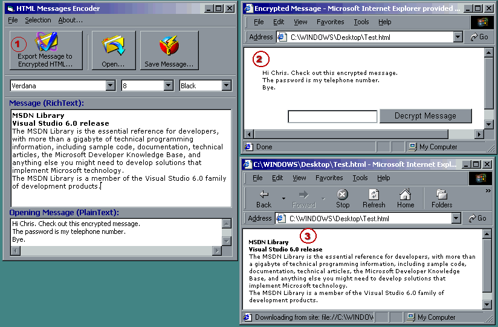



## Convert RichText to Encrypted HTML\!

### Description

This is an incredible program that lets you generate encrypted self-decrypting HTML files! It converts RichText to encrypted self-decrypting HTML files! Just type in your message in RichText format, choose a Password, and it automatically encrypts your message and generate that self-decrypting HTML file. Cool! How do you get the files decrypted? Simply with any IE browser, open it, type your Password, and you'll have the message automatically decrypted!
 
### More Info
 

             |
---                |---
**Submitted On**   |2001-03-06 23:50:28
**By**             |[Lio\_889](https://github.com/Planet-Source-Code/PSCIndex/blob/master/ByAuthor/lio-889.md)
**Level**          |Intermediate
**User Rating**    |4.3 (26 globes from 6 users)
**Compatibility**  |VB 5\.0, VB 6\.0
**Category**       |[String Manipulation](https://github.com/Planet-Source-Code/PSCIndex/blob/master/ByCategory/string-manipulation__1-5.md)
**World**          |[Visual Basic](https://github.com/Planet-Source-Code/PSCIndex/blob/master/ByWorld/visual-basic.md)
**Archive File**   |[CODE\_UPLOAD174303222001\.zip](https://github.com/Planet-Source-Code/lio-889-convert-richtext-to-encrypted-html__1-21852/archive/master.zip)

